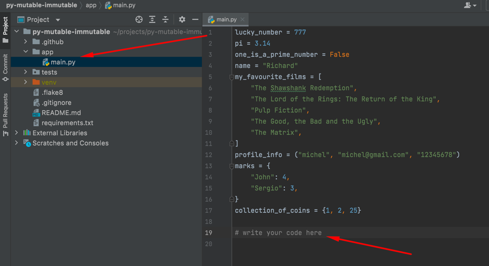
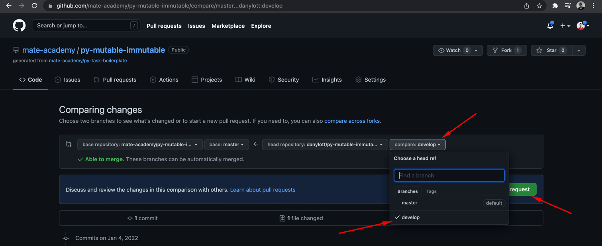
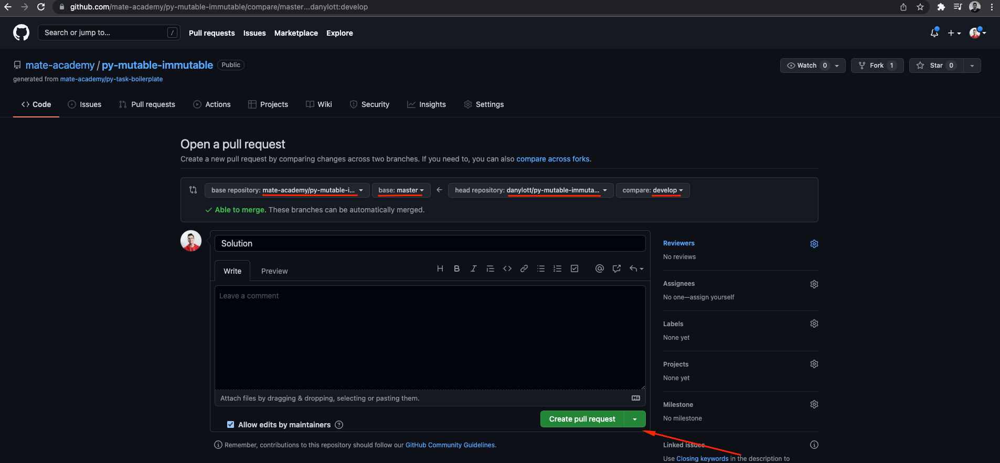

# Guideline how to implement solution for Python tasks

## Prepare the project
1. Fork the repo (GitHub repository)
1. Clone the forked repo
    ```
    git clone the-link-from-your-forked-repo
    ```
    - You can get the link by clicking the `Clone or download` button in your repo
1. Open the project folder in your IDE
1. Open a terminal in the project folder
1. Create a branch for the solution and switch on it
    ```
    git checkout -b develop
    ```
    - You can use any other name instead of `develop`
1. If you are using PyCharm - it may propose you to automatically create venv for your project 
    and install requirements in it, but if not:
    ```
    python -m venv venv
    venv\Scripts\activate (on Windows)
    pip install -r requirements.txt
    ```

## Implement the solution
1. Implement the solution within a function in `app/main.py`
    
1. Run `pytest` to check if your solution is correct (from command line, or using PyCharm `pytest` support)
    - If at least one test fails fix the solution and check again.
1. Run `flake8` to see if your code follows the [flake8 rules](https://www.flake8rules.com/)
    - If you see some errors fix them and check again
1. Save the solution
    ```
    git commit -am 'Solution'
    ```
1. Push the solution to the repo
    ```
    git push origin develop
    ```
    - If you created another branch (not `develop`) use its name instead

Note: if changes were added to GitHub task when you already forked it and 
downloaded to your local machine, follow this 
[guideline](./pull-changes-from-mate-repo-guideline/pull-changes-from-mate-repo-guideline.md) to pull changes.

## Create a Pull Request (PR)
1. Open your repo on GitHub and create a `Pull Request` (PR)
    
1. Select your branch in the dropdown!
    
1. Verify the PR details and code (scroll down to see it) and confirm
    

## If a mentor requested changes on your PR
1. Repeat [Implement the solution](#implement-the-solution) section
1. PR is updated automatically after a push to your branch on GitHub

> After updating your PR - click on re-request button at PR page IF YOU NEED ADDITIONAL REVIEW OF YOUR CODE.

