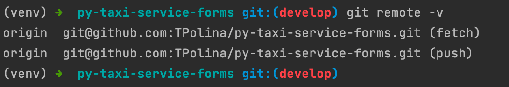
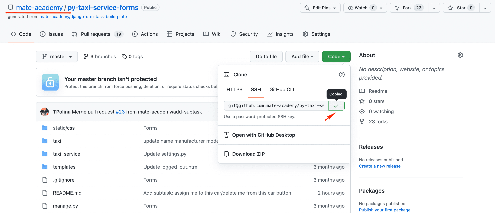
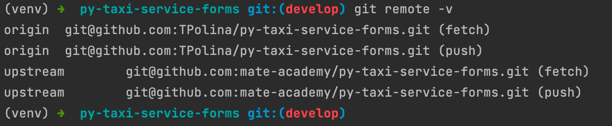

# How to pull changes from the Mate academy repository guideline

### Problem:
Sometimes mentors add changes to GitHub task when you already forked it and 
downloaded to your local machine.

### Solution:
To get changes from Mate academy repository you have to add connection between this
repository and your local machine and pull changes. Follow the instructions below.
1. Open a terminal and type the command to see your remote connections:
```
git remote -v
```
you should see one connection to your forked repository:



2. Go to origin Mate academy repository and copy a link to it:



3. Add another `remote` named 'upstream'. Pass link to Mate academy repository 
you've recently copied:
```
git remote add upstream <copied_url>
```
4. Check that new remote was added:
```
git remote -v
```
you should see two connections now:



5. Switch to `master` branch:
```
git checkout master
```
6. Pull changes from Mate academy repository:
```
git pull upstream master
```
7. Switch to your branch:
```
git checkout develop
```
Note: if you created another branch (not `develop`) use its name instead

8. Rebase commits from your branch:
```
git rebase master
```
9. Push changes to GitHub:
```
git push origin develop -f
```

Now you can continue working on the task.
